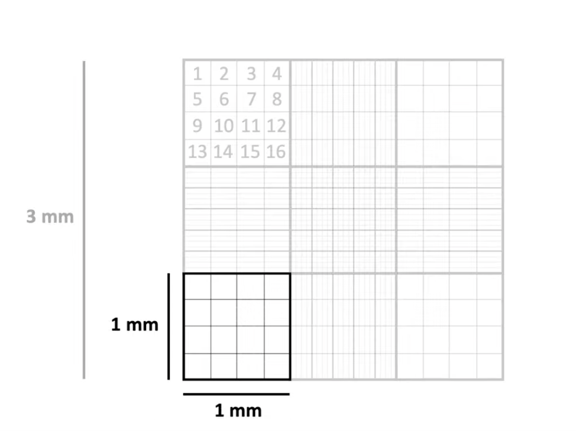
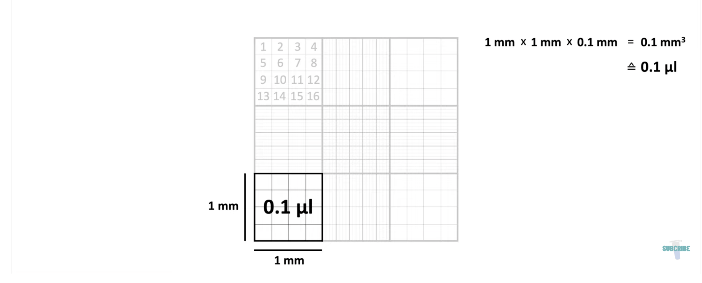

# Symbiodiniaceae Cell Density Counting Protocol

Original: 220200101   
Last Revised: 20221223

Contents  
- [**Materials**](#Materials)    
- [**Protocol**](#Protocol)  
- [**References**](#References)  
 
1.  **Materials**
    - 	Compound light microscrope
    -  Symbiont cell suspension
    - 	[Hemacytometer with included coverslip e.g.,](https://www.daigger.com/hemacytometers-with-cover-glass?q=EF16034F&gclid=Cj0KCQiAwJWdBhCYARIsAJc4idDEQu9nr_keJ5qXj8kIBKcP5V8v8faQvGJBsRivGAae1m-b9DiVL0gaAjMvEALw_wcB)
    - 	Glass pipet
    - 	DI Water (for cleaning)
    -  Kimwipes

2.  **Protocol**
	- Clean hemacytometer and **coverslip** with DI water by squirting and wiping with a kimwipe. Place on microscope stand, turn on microscope, and visually inspect to make sure no cells are visible on grid.

	- Vortex sample to homogenize.
	- Use a glass pipet to mix sample by pipetting up and down, then take a small amount and load one side of hemacytometer until liquid front completely moves across the glass slide. 
	- Use a glass pipet to take a new mixed aliquot from sample tube as above and fill the other side (do not fill both sides from same pipette fill)
	- Using 10x or higher objective, count cells in one side of the hemacytometer. Each grid is divided into nine large squares- keep track of how many you count. 
	- Count the number of cells in whole squares until you reach at least 100 cells (or count all squares). 
	- *Note: counting should be standardized- compare your first run with someone else to ensure equivalent standards for what consitutes a cell vs. debris. For cells falling exactly on the border of two squares, cells on the left and bottom border should be considered inside of the square, while cells on the top and right border should be considered outside.*   
	- Repeat with other side of hemacytometer, counting the same number of squares as before and recording the cell count and number of squares.  
	- Clean the hemacytometer and coverslip as before with DI water. Clean glass pipet with a tube of DI water.  
	- Repeat above steps twice more for 6 total counts.   
	- *Note: Each count should count the same number of the nine large squares. For example, if the first count for sample X requires 3 squares to reach 100 squares, 3 squares should be counted on all subsequent counts for sample X.*  
	- Make sure average # of cells/square is consistent (calculate coefficient of variation of counts in a sample- should be less than 10%).  
	- Multiply # of cells/square by 10^4 and the dilution factor to get cells/mL.  
	  
	  
	- Multiply by homogenate volume to get total cells.  
	- Normalize to surface area to get cells/surface area.  

**Coverslip is specially designed and weighted and no others can be substituted or the volume of the counting cell is not correct**

4.  **References**

    1.  Schoepf et al., 2013. Coral Energy Reserves and Calcification in a High-CO2 World at Two Temperatures. PLoS ONE 8:
    	e75049
    2. [General Counting Video](https://www.youtube.com/watch?v=rR1ov4VEJXQ)
